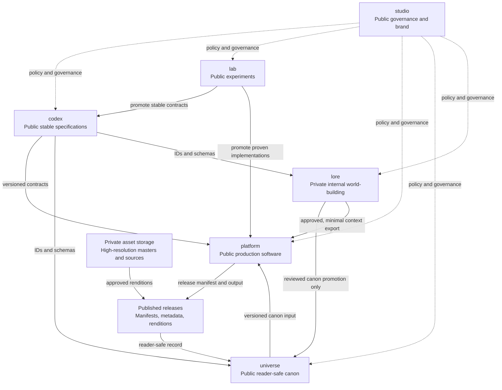

# Repository architecture

This document is the authoritative v1 map of the repositories owned by
Definitely Secure Studio. It defines where work belongs, which boundaries must
not be crossed, and the intended dependency direction. The governing decision
is [ADR 0003](adr/0003-repository-topology.md).

## Topology



Solid arrows show a movement of contracts, content, or artifacts. Dotted arrows
show governance rather than a build dependency. An arrow does not authorize the
consumer to copy or take ownership of the source material.

This is an ownership-level map. Exact tags, packages, artifact formats,
compatibility guarantees, and pinning rules are deferred to
[issue #33](https://github.com/DefinitelySecureStudio/studio/issues/33).

## Repository responsibility matrix

| Repository | Visibility | Single responsibility | Accountable owner | Contains | Explicitly excludes |
| --- | --- | --- | --- | --- | --- |
| `studio` | Public | Studio governance and public identity | Studio maintainers | Organization ADRs, roadmap, portfolio index, brand system, reusable governance policy | Runtime code, product specs, experiments, story canon, hidden lore |
| [`codex`](https://github.com/DefinitelySecureStudio/codex) | Public | Stable, implementation-neutral contracts | Specification maintainers | RFCs, IDs, schemas, taxonomies, prompt contracts, manifest and context-package specifications, conformance fixtures | Production runtime code, exploratory prompts, story content, secrets |
| [`lab`](https://github.com/DefinitelySecureStudio/lab) | Public | Disposable and exploratory creative-production R&D | Lab maintainers | Experimental agents, prompts, validators, prototypes, pipelines, synthetic fixtures, findings | Production services, authoritative specs, unpublished canon or lore, credentials |
| [`platform`](https://github.com/DefinitelySecureStudio/platform) | Public | Production software that operates the Studio toolchain | Platform maintainers | Runtime and application code, orchestration, indexing, automation, integrations, tests, deploy configuration, software releases | Ownership of specs, canon, lore, brand source, embedded secrets or private context |
| [`universe`](https://github.com/DefinitelySecureStudio/universe) | Public | Reader-safe creative canon and publication record | Canon editors | Universe bible, character and location canon, published comic metadata, story arcs, approved public assets and release records | Hidden continuity, unpublished twists, private communications, production software |
| `lore` | Private | Internal world-building and unrevealed continuity | Lore editors | Hidden timelines, internal company history, people, systems, communications, private context packages and unrevealed story material | Public governance, stable tooling contracts, production runtime code, the authoritative public canon record |

Visibility is part of the boundary, not the licensing decision. Public does not
mean every file is open source: brand and creative assets retain their stated
terms. The repository-by-repository license choice is handled by
[issue #31](https://github.com/DefinitelySecureStudio/studio/issues/31).

## Authoritative homes by content type

| Content | Authoritative home | Boundary rule |
| --- | --- | --- |
| Organization and topology ADRs | `studio/adr/` | Product-local implementation decisions stay with the product repository. |
| Product-local ADRs | The affected repository | Decisions spanning repositories are proposed and accepted in `studio`. |
| Experimental prompts and agents | `lab` | Use synthetic or already-public fixtures only. |
| Stable prompt contracts | `codex` | Contracts describe inputs and outputs; they do not contain proprietary story context. |
| Runtime prompt instances containing unrevealed context | `lore` or an approved secure runtime input | Never commit them to `lab`, `codex`, or `platform`. |
| Schemas, IDs, taxonomies, manifest specifications | `codex` | Consumers reference a version; they do not maintain forks as local truth. |
| Public canon and publication metadata | `universe` | Only reader-safe, editorially approved facts enter this repository. |
| Hidden lore and unrevealed continuity | `lore` | Promotion to `universe` is a reviewed copy of approved facts, not repository synchronization. |
| Brand source and approved brand exports | `studio/assets/brand/` and `studio/brand/` | Product repositories may consume approved exports but do not redefine the brand. |
| Public story assets and web-ready comic renditions | `universe` | Include only assets cleared for public distribution under their stated terms. |
| High-resolution masters and editable creative sources | Approved private asset storage outside the v1 Git repositories | Store immutable references and checksums in release manifests; do not force large or sensitive sources into Git. |
| Production code and deployable software artifacts | `platform` and its release registry | Code must load creative inputs through documented contracts rather than own them. |
| Comic release manifests and reader-safe release records | `universe` | The production pipeline emits them; canon editors approve them as the public record. |

## Boundary rules

1. **Authority is singular.** A fact, contract, or implementation has one
   authoritative repository. Consumers may cache generated outputs but must say
   where they came from and must not edit them as local source.
2. **Public tooling remains content-neutral.** `codex`, `lab`, and `platform`
   must not contain unpublished plot details, private character history, private
   production context, credentials, or proprietary lore. Examples and tests use
   synthetic or already-public data.
3. **Canon and lore are not mirrors.** `universe` is the public truth; `lore` is
   the private planning truth. Material moves from lore to canon only through an
   explicit editorial review, and later canon corrections do not automatically
   rewrite historical lore.
4. **Specifications are not implementations.** `codex` owns stable contracts;
   `platform` implements them. `lab` may explore either, but promoted work leaves
   the lab and adopts the receiving repository's change control.
5. **Governance is not a package dependency.** Repositories conform to decisions
   in `studio`, but builds and runtime operation must not depend on cloning it.
6. **Private context is minimized.** If production needs unrevealed material,
   `lore` produces the smallest approved context export. `platform` consumes the
   export as an input and must not persist it in source, logs, fixtures, or build
   artifacts.
7. **Generated artifacts identify provenance.** Until issue #33 establishes the
   final mechanism, every cross-repository artifact should record its source
   repository, immutable revision, schema/spec version, and generation time.

## Initial dependency rules

Allowed v1 dependency and promotion directions are:

```text
lab       -> codex       experimental contract becomes a stable specification
lab       -> platform    proven prototype is reimplemented or promoted
codex     -> platform    production code implements versioned contracts
codex     -> universe    public canon uses shared IDs and schemas
codex     -> lore        private lore uses shared IDs and schemas
lore      -> universe    editors promote an approved reader-safe fact
universe  -> platform    runtime consumes a versioned canon input
lore      -> platform    runtime consumes a minimal approved private export
platform  -> universe    pipeline proposes public release records for approval
```

No repository may form a build-time circular dependency. In particular:

- `codex` must not depend on `platform`, `universe`, or `lore` content;
- `platform` must not vendor `universe` or `lore` as source code;
- `universe` must not require access to `lore` to build or publish its public
  materials; and
- `studio` must not become a shared-code or shared-schema repository.

The `lore -> platform -> universe` production flow is an artifact workflow, not
a cycle of repository ownership: `platform` consumes immutable inputs and emits
a proposed release record; `universe` owns editorial acceptance of that record.

## Naming convention

Repository names under `DefinitelySecureStudio` use lowercase ASCII kebab-case:

```text
^[a-z0-9]+(?:-[a-z0-9]+)*$
```

- Prefer a short concrete noun that names the repository's single
  responsibility: `studio`, `codex`, `lab`, `platform`, `universe`, `lore`.
- Use a short qualifier only when the unqualified noun would be ambiguous, such
  as `comic-renderer` or `asset-pipeline`.
- Do not prefix names with `definitely-secure-` or `studio-`; organization
  membership already supplies that context.
- Do not encode implementation language, deployment environment, visibility,
  team name, or temporary status in the name.
- Do not use catch-all suffixes such as `misc`, `shared`, `common`, or `utils`.
- Reserve `.github` for organization-wide community health files if issue #32
  adopts that repository. Reserve the six v1 names for the responsibilities in
  this document.
- Never reuse the name of an archived repository for a different responsibility.

A future repository is justified only when it has an independent responsibility,
lifecycle, access boundary, or release cadence that cannot fit an existing
owner. The architecture ADR must be amended before creating a repository that
changes these boundaries.

## Repository creation order

Create the remaining repositories after this decision is merged:

1. `codex`, so all later repositories can point to the stable-contract owner.
2. `lab`, to establish the experiment-to-specification promotion path.
3. `platform`, to implement contracts without absorbing their ownership.
4. `universe`, to establish the public canon source.
5. `lore` as private, with access restricted before sensitive content is added.

Creating these repositories is tracked separately in issues
[#26](https://github.com/DefinitelySecureStudio/studio/issues/26) through
[#30](https://github.com/DefinitelySecureStudio/studio/issues/30). They should
link back to this document and restate their local scope in their README.
