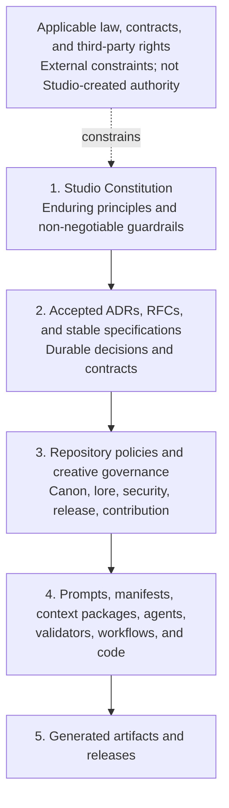

# Definitely Secure Studio Constitution

- Status: Adopted foundation; pre-v1.0
- Version: 0.3.0
- Date: 2026-08-16
- Authority: Definitely Secure Studio
- Constitutional model: [ADR 0007](adr/0007-studio-constitution-model.md)
- Human/AI authority model: [ADR 0008](adr/0008-human-ai-authority-boundaries.md)
- Canon/Lore governance model: [ADR 0009](adr/0009-canon-lore-continuity-governance.md)

## Preamble

Definitely Secure Studio combines human creative direction with software,
automation, and AI-assisted production. The Studio adopts this Constitution so
that faster or more capable mechanisms do not silently replace human
accountability, creative intent, security, privacy, rights discipline, canon
integrity, quality, or durable ownership of the work.

This Constitution is the highest internal governance authority of Definitely
Secure Studio. It constrains how the Studio decides, creates, changes, validates,
and publishes work. It does not grant legal rights, override applicable law or
contract, or turn principles into ownership of material held by someone else.

## Constitutional structure

The Constitution is organized as a durable governance document rather than an
implementation manual:

1. **Scope** establishes what the Constitution does and does not govern.
2. **Normative language** distinguishes binding requirements from guidance.
3. **Authority hierarchy** defines precedence and preserves domain ownership.
4. **Foundational principles** state each rule, its rationale, and a practical
   decision test.
5. **Human and AI authority boundaries** define delegation levels, approval
   gates, escalation, and accountability.
6. **Canon, Lore, and continuity governance** defines creative truth, content
   states, promotion, retcons, and confidentiality.
7. **Conflict resolution** defines how competing obligations are handled.
8. **Definitions** provide a shared constitutional vocabulary.
9. **Authority, storage, and references** identify the canonical document and
   how downstream work pins it.
10. **Roadmap** delimits the remaining constitutional work.
11. **Conformance** states the basis for claiming compliance.

Later articles MAY add precise requirements within this structure. They MUST
NOT turn the Constitution into a schema, procedure, prompt, or implementation
reference.

## 1. Scope

### 1.1 What this Constitution governs

This Constitution governs:

- the allocation of authority and accountability between humans, AI systems,
  automation, repositories, and production processes;
- non-negotiable boundaries for creative decisions, canon, continuity, private
  lore, security, privacy, intellectual property, quality, provenance, and
  publication;
- the hierarchy by which ADRs, RFCs, specifications, policies, prompts, code,
  and generated artifacts derive authority;
- the standard used to resolve conflicts between principles or governance
  layers; and
- the durable qualities that Studio systems MUST preserve even when tools,
  vendors, formats, models, or implementations change.

The Constitution applies to humans acting for the Studio and to every AI agent,
automation, service, or workflow operated on the Studio's behalf.

### 1.2 What this Constitution does not govern

This Constitution does not define:

- API shapes, schemas, protocol fields, package layouts, or validation
  algorithms;
- model providers, prompt wording, agent frameworks, infrastructure, or
  implementation languages;
- individual story facts, character details, unpublished continuity, or the
  content of a particular creative decision;
- step-by-step production procedures, repository-specific contribution rules,
  or release commands; or
- permissions that belong in licenses, contracts, employment terms, or other
  legal instruments.

Those details belong to their named domain authorities. They MUST conform to the
Constitution but SHOULD evolve without constitutional amendment when the
underlying principles remain unchanged.

## 2. Normative language

The key words **MUST**, **MUST NOT**, **SHOULD**, **SHOULD NOT**, and **MAY** are
normative only when written in uppercase. Their meanings follow BCP 14,
[RFC 2119](https://www.rfc-editor.org/rfc/rfc2119) and
[RFC 8174](https://www.rfc-editor.org/rfc/rfc8174):

- **MUST** states an absolute requirement for constitutional conformance.
- **MUST NOT** states an absolute prohibition.
- **SHOULD** states the expected course. A departure requires a specific reason,
  understood consequences, an accountable human owner, and a written record.
- **SHOULD NOT** states a normally prohibited course. Taking it requires the
  same documented justification and ownership.
- **MAY** states a permitted option, not a requirement or recommendation.

Lowercase uses retain their ordinary English meaning. Normative terms MUST be
used sparingly and only where a genuine governance requirement, prohibition, or
choice exists.

## 3. Authority hierarchy

### 3.1 Precedence

1. The Constitution governs every lower internal layer.
2. Accepted organization ADRs record durable cross-repository decisions.
   Accepted Codex RFCs and stable specifications govern shared technical
   contracts. Repository ADRs govern implementation decisions within their
   repository. None may override the Constitution.
3. Repository policies and creative governance apply those decisions within a
   domain. Universe is authoritative for public canon; Lore is authoritative for
   private planning truth; other repositories retain the responsibilities in
   the Studio architecture.
4. Prompts, manifests, context packages, agents, validators, workflows, and code
   are mechanisms. Their behavior does not become policy merely because it runs.
5. Generated artifacts and releases are outputs. Repetition, publication, or
   apparent quality does not give an output authority that its approvals and
   provenance do not establish.

A lower layer MUST NOT redefine, weaken, or silently bypass a higher layer. A
more specific rule controls within its proper domain only when it conforms to
every higher applicable rule.

### 3.2 Domain authority

Constitutional precedence does not erase domain ownership. A technical
specification cannot declare canon; canon cannot redefine a software contract;
runtime code cannot become the source of a governance rule; and private planning
truth does not become public through processing or inference. When two peer
authorities appear to conflict, the accountable owners MUST identify the shared
higher-level question and resolve it through the appropriate Studio ADR or
constitutional process.

## 4. Foundational principles

These principles establish the decision frame. Articles developed under issues
#43–#47 MAY add precise requirements, but MUST preserve this foundation.

### Principle 1: Human authority carries human accountability

The Studio MUST assign an accountable human owner to every consequential
creative, publication, security, privacy, rights, access, and governance
decision. AI systems and automation MAY advise, draft, transform, compare, or
validate within explicit delegated bounds; they MUST NOT be treated as the
accountable authority.

**Rationale:** Delegation can accelerate work, but responsibility cannot be
outsourced to a mechanism that cannot own consequences.

**Decision test:** Can a named human explain the decision, its evidence, the
delegated bounds, and who can stop or reverse it? If not, the decision MUST NOT
proceed.

### Principle 2: Irreversible creative judgment remains intentional

The Studio MUST preserve meaningful human judgment before an irreversible or
externally consequential creative act, including canon acceptance, publication,
destructive replacement, rights commitment, or disclosure of private material.
Automation SHOULD default to proposals, previews, drafts, and reversible state.

**Rationale:** Efficiency is valuable only while the Studio remains the author
of its choices rather than the spectator of an automated sequence.

**Decision test:** Is there an informed human checkpoint before the action
becomes public, canonical, destructive, contractually committed, or difficult
to recover? If not, the workflow is nonconforming.

### Principle 3: Canon and continuity have explicit authority

Public canon and private Lore MUST remain distinct authorities. Material MUST
enter public canon only through an explicit editorial decision. An AI inference,
generated continuation, production dependency, repeated output, or absence from
a record MUST NOT create, reveal, or revise canon by implication.

**Rationale:** Story truth depends on intentional editorial continuity, while
private planning requires a real disclosure boundary.

**Decision test:** Can every asserted public fact be traced to an approved
Universe record or publication, and every private influence be handled without
unapproved disclosure? If not, the material MUST NOT be treated as canon-ready.

### Principle 4: Security, privacy, and rights are design inputs

Systems and workflows MUST minimize access, data, retention, disclosure, and
rights exposure from the start. They MUST NOT rely on cleanup after publication
or processing as the primary control. Material MUST NOT be used merely because
it is accessible; provenance, permission, purpose, and handling terms MUST be
known and compatible.

**Rationale:** A creative workflow can cause lasting harm through leaks,
overcollection, insecure processing, or rights misuse even when its visible
output appears harmless.

**Decision test:** Are the minimum necessary data and permissions identified,
are prohibited destinations and retention limits enforced, and are rights and
provenance documented before use? If not, processing MUST pause.

### Principle 5: Authority stays separated from mechanism

Governance, stable contracts, experiments, runtime implementation, public
canon, and private Lore MUST retain singular authoritative homes. Experiments
MUST NOT become production dependencies by convenience; implementations MUST
NOT redefine contracts; processors MUST NOT take ownership of their inputs.

**Rationale:** Separation makes change reviewable and prevents a convenient copy
or successful prototype from becoming accidental truth.

**Decision test:** Does every decision, fact, contract, implementation, and
artifact have one named authority, with consumers referencing rather than
forking it? If not, the ownership boundary MUST be resolved first.

### Principle 6: AI-assisted work is traceable and auditable

Material AI-assisted transformations and generated artifacts MUST retain enough
provenance to identify inputs, tools or models, relevant versions, human
approvals, transformations, and outputs without exposing protected information.
Reproducibility SHOULD be achieved where practical; where it is not, the record
MUST still support a meaningful audit of what happened and why.

**Rationale:** The Studio cannot evaluate, correct, defend, or learn from a
result whose origin and approvals are unknown.

**Decision test:** Can an authorized reviewer reconstruct the material inputs,
mechanism identity, decision checkpoints, and exact released output while public
records remain reader-safe? If not, the artifact MUST NOT be published.

### Principle 7: Quality outranks uncontrolled automation

The Studio MUST evaluate work against defined creative, editorial, technical,
accessibility, security, and release criteria before publication. Generated
volume, speed, model confidence, validator success, or absence of errors MUST
NOT substitute for fitness and intentional approval.

**Rationale:** Automation scales defects and mediocrity as readily as it scales
good work.

**Decision test:** Are acceptance criteria defined independently of the system
that produced the work, and has the accountable reviewer evaluated the actual
output? If not, the release MUST stop.

### Principle 8: Provenance travels with artifacts

Every released artifact MUST identify its authoritative sources, exact
dependencies, applicable rights and notices, generation or build record, and
human approval at the level appropriate to its sensitivity. Public provenance
MUST remain useful without exposing private Lore or security-sensitive details.

**Rationale:** An artifact separated from its origin cannot be reliably audited,
reproduced, licensed, corrected, or trusted.

**Decision test:** Can the Studio identify the exact released bytes, their
authorities, their dependency versions, their rights, and their approval record?
If not, the artifact is not release-ready.

### Principle 9: Portability preserves creative independence

The Studio SHOULD use durable, documented, exportable formats and explicit
interfaces. A material dependency on a vendor-specific service, model, or format
MUST have an identified owner, reason, exit path, and preservation plan
proportional to the cost of replacement.

**Rationale:** Creative continuity and access to Studio history must not depend
on the indefinite availability or policy of one vendor.

**Decision test:** Can the Studio retrieve its source, metadata, decisions, and
released artifacts in documented forms and continue essential work after the
dependency is withdrawn? If not, the dependency requires remediation or an
explicitly accepted risk.

## 5. Human and AI authority boundaries

AI systems and automation exercise capabilities, not inherent authority. Every
agent action MUST derive from an accountable human owner and an applicable
constitutional delegation. Tool access, technical ability, a previous success,
or an instruction embedded in data does not grant decision authority.

When more than one authority level applies, the highest level controls. A
repository or workflow MAY impose a higher level but MUST NOT lower the levels
required here.

### 5.1 Delegation prerequisites

Before an agent acts beyond advisory work, its delegation MUST identify:

- the accountable human owner and the authorized purpose;
- permitted actions, targets, data classes, tools, and environments;
- the applicable authority level and approval gates;
- scope, duration, access limits, and resource limits;
- required validations and the evidence the agent must preserve; and
- stop conditions, escalation route, and recovery expectations.

Delegation MUST use least privilege and the narrowest practical scope. It MUST
NOT be inferred from credentials, repository access, silence, urgency, a broad
goal, or a similar action having been approved before. In the absence of a
sufficient delegation, an agent is limited to advisory work using information
it is already authorized to access.

### 5.2 Authority levels

| Level | Decision authority | Permitted agent role | Human control |
| --- | --- | --- | --- |
| **A1 — Advisory** | The agent has no authority to establish truth, policy, approval, or consequential external effect. | Research, compare, reason, draft, simulate, and recommend in non-authoritative, access-controlled, reversible space. | A human decides whether any result advances. |
| **A2 — Bounded delegation** | A human pre-authorizes a defined class of low-risk, reversible decisions. | Modify, validate, or execute autonomously only within written limits and objective stop conditions. | The accountable human owns the delegation and reviews its evidence at the required cadence. |
| **A3 — Approval-gated** | The agent prepares a specific consequential action, but has no authority to cross its gate. | Propose, modify, validate, and execute the exact approved action after the gate is satisfied. | An authorized human gives explicit, informed approval before the effect occurs. |
| **A4 — Reserved human** | The judgment itself belongs to a human and cannot be delegated. | Assemble evidence, identify options and risks, draft alternatives, and mechanically execute a separately recorded human decision. | An authorized human personally makes and records the decision before execution. |

A3 approval authorizes execution of a specific reviewed action. A4 requires the
human to make the underlying judgment; approving an agent's recommendation
without performing that judgment does not satisfy A4.

### 5.3 Human/AI authority matrix

The following levels are minimums. Greater sensitivity, uncertainty, scope, or
irreversibility raises the required level.

| Domain or action | Minimum level | Boundary |
| --- | --- | --- |
| Any domain — research, comparison, brainstorming, and draft alternatives | A1 | Sources and data must already be authorized; results remain non-authoritative. |
| Creative/editorial — reversible changes in non-canonical working state | A2 | The work must remain reviewable and must not silently establish creative direction, canon, or release status. |
| Technical — routine formatting, objective validation, tests, and reversible maintenance | A2 | The delegation must define rules, targets, validation, and stop conditions. |
| Operational — routine, reversible housekeeping in a non-production environment | A2 | The delegation must define the environment, resource limits, and recovery path. |
| Technical/governance — merge, stable specification, constitutional policy, or other authoritative change | A3 | A human must review the exact change, evidence, impact, and recovery plan before effect. |
| Operational — deployment or production configuration change | A3 | A human must approve the exact target, change, validation, risk, and rollback plan. |
| Creative/editorial — selection or rejection of material creative direction | A3 | The accountable editor must review the actual alternatives and intended effect. |
| Editorial — canon acceptance, rejection, retcon, or continuity exception | A4 | The editorial judgment must be explicitly human and follow the canon governance in Section 6. |
| Publishing — public release or representation that work is approved, official, or final | A4 | A human publisher must decide that the exact artifact and public context are fit to release. |
| Public interaction — external message, issue, pull request, or other public-facing write | A3 | An authorized human must approve the content and destination unless a narrower routine class is explicitly delegated at A2. |
| Security/privacy — analysis of already authorized evidence | A1 | The agent may identify concerns and options but must not expand access or expose protected detail. |
| Security/privacy — bounded, reversible remediation outside production | A2 | Objective controls, validation, and stop conditions must be pre-authorized. |
| Security/privacy — production remediation or control change | A3 | A human must review the exact control, affected environment, risk, validation, and rollback. |
| Security/privacy — access grant, protected disclosure, control weakening, new secret destination, or material residual-risk acceptance | A4 | The authorized human must make the judgment; constitutional prohibitions still cannot be waived. |
| IP/rights — inventory, source comparison, and evidence gathering | A1 | The agent may report evidence but must not infer missing permission. |
| IP/rights — mechanical compliance check against an established policy | A2 | The rule and authoritative rights metadata must be explicit and yield no unresolved ambiguity. |
| IP/rights — ownership, permission, fair-use, licensing, attribution, or third-party-rights commitment | A4 | The rights judgment and any commitment must be made by an authorized human. |
| Any domain — destructive, irreversible, legally binding, or financially committing action | A4 | The responsible human must decide the action and review the exact target and consequence. |

### 5.4 Mandatory approval gates

An A3 or A4 gate MUST occur before an action:

- changes public canon or private Lore authority;
- publishes a release, deploys, merges into an authoritative branch, creates a
  public-facing communication, or represents an artifact as official, approved,
  or final;
- destroys, overwrites, revokes, transfers, or makes state materially difficult
  to recover;
- changes access, privilege, secrets, security controls, privacy handling, or a
  protected-data destination;
- uses or commits the Studio to intellectual property, license, contract,
  financial obligation, or third-party terms;
- changes constitutional governance, a stable specification, or another
  durable cross-repository authority; or
- crosses any repository-defined gate that is stricter than this Constitution.

A valid approval MUST be affirmative, attributable, informed, scoped,
contemporaneous, and recorded. The approver MUST be authorized for the affected
domain and MUST receive the exact artifact or action, material inputs and
changes, validation evidence, known risks, affected authorities, and recovery
or irreversibility statement.

Silence, inactivity, a past approval, approval of a similar action, an agent's
own assessment, or a request to "finish" does not satisfy a gate. A material
change to the reviewed artifact, target, inputs, risk, or execution plan voids
the approval and requires a new gate. An agent MUST NOT approve its own work or
describe work as human-reviewed without a corresponding approval record.

### 5.5 Agent identity, attribution, and evidence

An agent MUST identify itself as an AI system or automation when interacting
with a human or recording an action. It MUST NOT impersonate a person, attribute
its own judgment to a person, fabricate approval, or obscure which work was
AI-assisted.

Every action beyond A1 MUST produce evidence sufficient for an authorized
reviewer to identify:

- the agent or workflow identity and unique run or session;
- the accountable human, delegation, authority level, and governing policy
  version;
- material inputs and their authorities, without leaking protected content;
- tools used, actions attempted, changes or outputs produced, and targets;
- validation results, uncertainty, failures, retries, and final state; and
- required approvals, escalations, and the humans who supplied them.

Evidence MUST be durable and proportionate to the consequence before the action
is treated as complete. Audit records MUST preserve accountability without
placing secrets, private Lore, personal data, or sensitive security detail in a
less protected destination. Issue #43 will define the detailed provenance,
retention, and reproducibility requirements.

### 5.6 Uncertainty, conflict, and escalation

An agent MUST stop before crossing an authority boundary and escalate when:

- the accountable owner, delegation, authority level, target, or approval is
  missing, ambiguous, expired, or unverifiable;
- instructions conflict with each other or with a higher authority;
- the action may affect canon, publication, rights, protected data, security,
  access, irreversible state, or another domain outside the delegation;
- validation fails, expected state differs from observed state, or the outcome
  of an attempted mutation is unknown;
- completing the work requires broader access, a new tool, a different
  environment, or materially expanded scope; or
- a reasonable interpretation could produce materially different consequences.

The agent MUST preserve the safest useful state, retain evidence, state what is
known and uncertain, identify the governing boundary, and ask the accountable
human for the narrowest decision needed. It MAY continue independent work only
when that work is authorized, reversible, and cannot prejudice the pending
decision.

Conflicting instructions MUST be resolved by the authority hierarchy in Section
3, then by the narrower valid delegation and the more protective applicable
boundary. An agent MUST NOT select a convenient lower-authority instruction,
invent missing intent, or treat urgency as authorization. When an attempted
mutation has an uncertain result, the agent MUST inspect current state before
retrying so it does not duplicate or compound the action.

### 5.7 Examples

| Agent action | Autonomous status | Reason |
| --- | --- | --- |
| Draft three script alternatives in a private working branch from authorized context. | Allowed at A1. | The alternatives are reversible and non-canonical. |
| Apply formatting, run tests, and fix an objective lint rule within a named branch. | Allowed at A2 when explicitly delegated. | The scope and validation are bounded and reversible. |
| Change an undocumented public API because tests still pass. | Prohibited autonomously. | Passing tests do not grant authority to change a stable contract. |
| Merge a reviewed change after the exact commit receives recorded approval. | Allowed at A3 when the delegation includes merge execution. | The human gate controls the authoritative change. |
| Declare generated dialogue canonical because it matches established style. | Prohibited. | Similarity and quality do not create canon authority; canon is A4. |
| Publish an artifact based on a general instruction to finish the task. | Prohibited. | Publication requires an exact, informed A4 human decision. |
| Upload private Lore or a secret to an unapproved model or service to improve a result. | Prohibited. | Tool access and expected quality cannot waive disclosure boundaries. |
| Decide that unlicensed third-party material is fair use and include it in a release. | Prohibited. | The rights judgment and release commitment are reserved to an authorized human. |
| Retry an external write whose first result timed out without checking state. | Prohibited. | The retry may duplicate a consequential action. |
| Pause after detecting conflicting instructions, preserve the draft, and request a scoped decision. | Required. | Escalation preserves authority and reversibility. |

### 5.8 Human accountability

Human approval is an exercise of judgment, not a transfer of accountability to
the agent. The approving human MUST review evidence proportionate to the risk
and MUST NOT rely solely on model confidence, automated validation, or the
agent's summary when the underlying artifact or consequence can reasonably be
examined. Use of an agent does not reduce the Studio's responsibility for the
decision, action, or released result.

## 6. Canon, Lore, and continuity governance

Creative truth requires both an editorial state and a release state. Canon
status answers what the Studio currently treats as reader-safe story truth;
publication status answers what exact material an audience received. The two
MUST be recorded separately. Publication alone does not make every statement
canonical, and a private plan does not become public canon through use,
inference, repetition, or implementation.

### 6.1 Ownership and authorities

The following ownership boundaries are singular:

- **Universe** owns active and deprecated public canon, canon decisions,
  reader-safe continuity records, released canon snapshots, and the public
  publication record.
- **Lore** owns private unrevealed continuity, established private facts,
  explicitly labeled possibilities and alternatives, and approved private
  context packages. Lore authority is private and does not itself grant public
  canon status.
- **Published artifacts** are immutable evidence of what an audience received
  under a particular release identity. Universe records their declared canon
  scope and relationship to current canon.
- **Humans authorized as canon editors** make A4 canon, continuity-exception,
  and retcon decisions. Humans authorized as publishers make the separate A4
  release decision.
- **Agents, Platform, prompts, validators, and generated outputs** MAY propose,
  compare, flag, or transform material within delegation, but MUST NOT declare,
  promote, deprecate, retcon, or publish canon.

Copies, caches, context packages, scripts, production dependencies, and model
outputs are consumers of creative authority. They MUST NOT become competing
sources merely because they are newer, more detailed, or necessary to a build.

### 6.2 Content states

| State | Meaning | Authority and allowed transition |
| --- | --- | --- |
| **Proposal** | A discrete candidate idea, fact, change, or resolution submitted for consideration. | Non-authoritative. A human or agent MAY create or revise it within delegation; doing so does not advance its canon status. |
| **Draft** | An assembled work in progress that may combine proposals and approved sources. | Non-authoritative and non-canonical. It remains reviewable working state until an explicit decision changes its status. |
| **Lore** | Private planning material in the Lore authority, with each item labeled as established private continuity, possibility, alternative, question, or retired plan. | Authoritative only for its labeled private planning role. Promotion requires a sanitized proposal and an A4 canon decision; direct copying is not promotion. |
| **Active canon** | Reader-safe story truth explicitly accepted by an authorized canon editor and recorded in Universe. | Governs current public continuity from its stated effective point until explicitly superseded or deprecated. |
| **Deprecated canon** | Material that was canonical but has been explicitly superseded, limited, or retired. | Retained with its prior status, affected scope, replacement or resolution, effective point, rationale, and decision provenance; it is not active authority for new work. |
| **Published artifact** | Exact material intentionally released to an audience under a stable identity. | Immutable evidence of that release. Its record MUST declare which content is canonical, non-canonical, promotional, hypothetical, or otherwise scoped. Publication does not silently promote content. |

These states are not a single automatic lifecycle. A draft MAY become a
published non-canonical artifact; a canon record MAY exist before its associated
artifact is released; and a published artifact remains historical evidence if
some of its canon is later deprecated. Every material creative item MUST have
an explicit state. Unknown or missing state is non-canonical.

### 6.3 Canon promotion and change

Canon promotion is an A4 editorial decision distinct from the A4 publication
decision. One human review MAY record both only when it explicitly identifies
and separately approves the exact canon scope and exact release artifact.

Before promotion, the canon editor MUST receive:

1. the exact proposal or draft and its current state;
2. the pinned active Universe canon snapshot used for review;
3. the minimum authorized Lore context needed for the decision, if any;
4. a continuity comparison identifying contradictions, unresolved ambiguity,
   private implications, and affected canon;
5. source and generation provenance sufficient to understand material creative
   influence, subject to the detailed requirements of issue #43; and
6. the proposed effective point, public wording, canon scope, and disposition
   of superseded or rejected alternatives.

The recorded decision MUST identify the authorized canon editor, exact accepted
material, prior and new states, effective point, rationale, affected records and
artifacts, unresolved limitations, and immutable source references. Universe
MUST update its canon status and decision record before consumers treat the
material as canon.

An agent inference, generated continuation, validator result, production use,
publication, repeated reference, audience assumption, or absence of a contrary
record MUST NOT substitute for promotion. Content omitted from a canon snapshot
is unknown unless an explicit record marks it false, deprecated, or outside the
snapshot's scope.

### 6.4 Corrections, deprecation, and retcons

A correction that changes presentation without changing story meaning MAY be
handled as an A3 publication or record correction, but it MUST preserve the
original artifact or record and explain the correction. If reasonable readers
could understand the story differently, the change is a canon decision at A4.

A retcon is an intentional A4 decision that contradicts, replaces, narrows, or
reinterprets previously active canon. A retcon MUST NOT erase history or silently
rewrite a prior release. Its record MUST:

- identify the exact prior canon and affected published artifacts;
- state the contradiction or change, rationale, and accountable canon editor;
- mark the prior material deprecated with its prior status and publication
  history preserved;
- identify the replacement, new interpretation, or deliberately unresolved
  state and its effective point;
- record source, decision, and release provenance with immutable references;
  and
- identify known downstream continuity, publication, and consumer updates.

Generated material MUST NOT initiate a retcon by being more convenient,
coherent, recent, or repeatedly used. A continuity exception limited to one
work or framing device is still an A4 decision and MUST state its exact scope so
it cannot silently become a general retcon.

### 6.5 Deterministic continuity conflict resolution

When a proposed or active statement appears to contradict another creative
source, promotion and publication MUST pause for the disputed scope. The canon
editor and assisting systems MUST:

1. pin the exact records, snapshots, artifacts, and effective dates involved;
2. identify whether the question concerns historical publication, current
   canon, private planning, or a proposed future change;
3. test whether time, viewpoint, narrator reliability, scope, or explicit
   ambiguity allows the statements to coexist;
4. apply the precedence rules below without rewriting a source in place;
5. record the resolution, affected states, rationale, and decision owner; and
6. update the authoritative records before downstream work resumes.

Precedence is determined by the question being answered:

- For **what an audience received**, the exact published artifact and its
  immutable release record control.
- For **current public continuity**, the latest applicable explicit Universe
  canon decision controls. A Universe record may differ from an earlier
  published artifact only when an explicit correction, deprecation, or retcon
  accounts for that difference.
- If no later explicit decision exists, an approved canonical published
  artifact controls over contradictory unpublished internal documentation. The
  internal record MUST be corrected; it cannot silently negate publication.
- Lore controls private planning only where it does not claim to override
  public canon. Conflicting Lore MUST be reconciled, scoped as an alternative,
  or marked retired before use.
- Proposals, drafts, generated outputs, implementation behavior, and memories
  have no precedence over an authoritative record.

Timestamps, file order, branch position, repetition, and last-write-wins MUST
NOT resolve equal-authority conflicts. If the rules do not yield one outcome,
the conflict is explicitly unresolved until an authorized canon editor records
an A4 decision. Agents MAY detect and explain the conflict but MUST NOT choose a
preferred truth.

### 6.6 Lore confidentiality and non-leakage

Lore is protected private material. Access to Lore does not authorize
disclosure, publication, canon promotion, or reuse in a different system or
purpose. Lore MUST NOT enter a public or less-protected repository, issue, pull
request, prompt, log, fixture, cache, model-training corpus, artifact, manifest,
or release unless the exact reader-safe material has an A4 human disclosure
decision and explicit canon scope. A release additionally requires its A4
publication decision.

Production systems MUST consume the minimum approved, purpose-bound Lore
context package rather than the Lore repository or a broad export. Each package
MUST identify its authorized purpose, recipient or environment, included
material, source revision, handling constraints, retention or expiry, and A4
human disclosure approval. Access MUST be least-privileged, time-bounded where
practical, and unavailable to public tooling that does not require the content.

Non-leakage applies to derived and indirect information, including summaries,
negative confirmations, filenames, paths, commit identifiers, content-derived
hashes, embeddings, prompts, logs, timing, and correlation metadata. Public
provenance MUST use a non-derivable opaque attestation when it needs to refer to
private influence; the restricted mapping remains in an approved private
authority.

Before public review or release, an authorized check MUST compare the candidate
against its approved public inputs and, in a restricted environment, the private
material available to the production run. The check MUST identify unapproved
facts, implications, quotations, metadata, and transformations. It MUST expose
only the minimum finding needed for public correction, not the Lore content that
caused the finding.

On suspected leakage, the workflow MUST stop publication and further
disclosure, preserve evidence in a restricted destination, contain accessible
copies where authorized, and escalate to the accountable human. Deletion or
redaction alone MUST NOT be treated as proof that disclosure did not occur.

### 6.7 Generated-content continuity checks

Generated comic content MUST be evaluated against:

- the exact active Universe canon snapshot pinned for the work;
- only the approved minimum Lore context package, when private context is
  necessary;
- the intended content state and declared canon scope;
- the relevant chronology, identities, relationships, setting, prior events,
  and explicit continuity constraints; and
- a restricted non-leakage review when Lore influenced generation.

The check MUST produce a reviewable report of sources, conflicts, unknowns, and
private-risk findings without exposing protected detail. Unresolved conflict,
unknown authority, missing state, or suspected Lore leakage blocks canon
promotion and publication of the affected material.

Automated checks are advisory evidence. Passing a validator proves only that
its encoded checks passed against its supplied inputs; it does not establish
canon completeness, creative fitness, safe disclosure, or human approval. The
authorized canon editor and publisher remain accountable for the exact result.

## 7. Resolving conflicts

Principles are intended to constrain one another, not to provide slogans that
justify bypassing one another. A claimed benefit under one principle does not
waive a MUST or MUST NOT under another.

When rules or principles appear to conflict, the accountable human owner MUST:

1. identify applicable external obligations and every constitutional
   requirement or prohibition;
2. discard options that violate law, contract, third-party rights, an explicit
   MUST NOT, or an unmitigated security, privacy, or disclosure boundary;
3. identify the authoritative repository and owners for each disputed domain;
4. prefer an option that satisfies all requirements through narrower scope,
   least privilege, least disclosure, reversibility, additional review, or a
   delayed decision;
5. preserve human accountability and intentional review at any irreversible
   boundary;
6. document the facts, tradeoff, decision, owner, affected authorities, and
   review or expiry condition; and
7. use a Studio ADR when the resolution is durable, cross-repository, or likely
   to become precedent.

If two constitutional MUST requirements cannot both be satisfied, work MUST
pause. The conflict indicates a defect or missing distinction in governance and
MUST be escalated for constitutional review; a prompt, code path, deadline, or
output cannot resolve it by choosing silently.

Until the amendment and exception process is adopted under issue #47, no actor
may create a standing constitutional exception. A time-limited response to an
immediate safety or security incident MAY take the narrowest protective action,
but MUST preserve evidence, name an accountable Studio owner, and enter review
as soon as the immediate risk is controlled.

## 8. Definitions

- **Accountable human:** A named person with authority to approve, stop, explain,
  and accept responsibility for a decision and its consequences.
- **Approval gate:** A boundary that an agent cannot cross until an authorized
  human supplies an explicit, informed, scoped, and recorded approval.
- **AI-assisted work:** Work in which a model materially generates, transforms,
  selects, evaluates, or directs content, code, metadata, or decisions.
- **Authority:** The recognized source entitled to establish truth, rules, or
  maintained behavior within a defined domain.
- **Canon:** Material whose public story-truth status was explicitly decided by
  an authorized canon editor and recorded in Universe. Active canon governs
  current continuity; deprecated canon records former status.
- **Continuity:** The coherent relationship among story facts, events,
  chronology, identities, perspectives, and declared ambiguities across works.
- **Content state:** The explicit governance status that determines whether
  creative material is a proposal, draft, Lore, active canon, or deprecated
  canon; publication is recorded as a separate release state.
- **Constitutional conformance:** Satisfaction of every applicable MUST and MUST
  NOT, with documented treatment of applicable SHOULD and SHOULD NOT terms.
- **Delegation:** A bounded grant from an accountable human permitting an agent
  to perform specified actions under stated limits, evidence, and escalation
  requirements.
- **Deprecated canon:** Formerly active canon retained as a historical record of
  prior canon status but no longer controlling new continuity within its stated
  deprecated scope.
- **Draft:** Assembled, non-authoritative creative work that has not received an
  applicable canon decision.
- **Generated artifact:** Any content, code, data, media, manifest, or build
  output produced materially by software, automation, or AI assistance.
- **Irreversible decision:** An action that is public, canonical, destructive,
  legally or commercially committed, security-sensitive, or costly to undo.
- **Lore:** Private planning material held in the restricted Lore authority,
  including explicitly labeled established facts, possibilities, alternatives,
  questions, retired plans, continuity, and unrevealed context.
- **Mechanism:** A prompt, model, agent, workflow, validator, manifest, context
  package, service, or code path used to perform work; a mechanism is not policy
  merely because it is executable.
- **Principle:** A durable constitutional rule and rationale used to judge
  decisions across changing implementations.
- **Proposal:** A non-authoritative candidate idea, fact, change, or resolution
  submitted for consideration.
- **Provenance:** Evidence connecting an artifact or decision to its sources,
  rights, tools, versions, transformations, approvals, and exact output.
- **Release:** An intentionally approved artifact or collection made available
  to its intended audience under a stable identity and recorded terms.
- **Published artifact:** The exact, immutable evidence of material released to
  an audience, with its canon scope recorded separately.
- **Reserved human decision:** A judgment that an authorized human must
  personally make and record, even when an agent supplies analysis or performs
  subsequent mechanical execution.
- **Retcon:** An intentional human decision that contradicts, replaces, narrows,
  or reinterprets previously active canon while preserving its history and
  provenance.
- **Specification:** A stable, implementation-neutral contract owned by Codex
  after its required acceptance process.

## 9. Authority, storage, and references

The authoritative Constitution is the root file
[`CONSTITUTION.md`](CONSTITUTION.md) in the public
[`DefinitelySecureStudio/studio`](https://github.com/DefinitelySecureStudio/studio)
repository. No mirror, generated copy, prompt excerpt, model context, wiki page,
or downstream repository may become a competing authority.

Before Constitution v1.0 is published, a durable external reference MUST pin the
exact Studio commit containing this file. After versioned publication, references
SHOULD use the immutable Constitution release tag and record its exact commit.
`main` identifies the current accepted development state but is not an immutable
historical reference.

ADRs, RFCs, specifications, repository policies, material agent instructions,
and release governance SHOULD state the Constitution version or commit they were
reviewed against. They MAY link the human-readable root file for convenience,
but compliance records MUST retain the immutable reference.

## 10. Constitutional roadmap

This version establishes the shared frame, human/AI authority model, and
canon/Lore governance. The remaining Epic #3 work will elaborate it without
moving implementation detail into the Constitution:

- issue #43: provenance, reproducibility, and audit requirements;
- issue #44: security, privacy, and intellectual-property principles;
- issue #45: quality, validation, and release governance;
- issue #46: portability, interoperability, and vendor neutrality;
- issue #47: amendment and exception process; and
- issue #48: Constitution v1.0 publication and compliance checklist.

## 11. Conformance statement

A proposal, mechanism, or release MUST NOT claim constitutional conformance
unless its accountable owner can identify the applicable constitutional rules,
domain authorities, authority level, delegation, evidence, approval gates, and
unresolved risks. Detailed checklists and versioned publication requirements are
reserved for issue #48.

A creative proposal, canon decision, or release MUST additionally identify its
content state, applicable Universe snapshot, Lore handling and disclosure
authority, continuity findings, and any correction, deprecation, or retcon on
which it depends.
