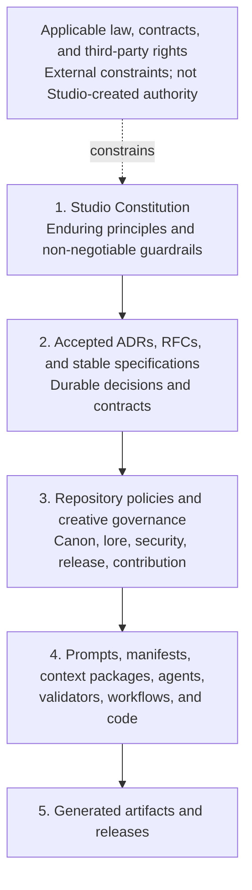

# Definitely Secure Studio Constitution

- Status: Adopted foundation; pre-v1.0
- Version: 0.1.0
- Date: 2026-08-16
- Authority: Definitely Secure Studio
- Constitutional model: [ADR 0007](adr/0007-studio-constitution-model.md)

## Preamble

Definitely Secure Studio combines human creative direction with software,
automation, and AI-assisted production. The Studio adopts this Constitution so
that faster or more capable mechanisms do not silently replace human
accountability, creative intent, security, privacy, rights discipline, canon
integrity, quality, or durable ownership of the work.

This Constitution is the highest internal governance authority of Definitely
Secure Studio. It constrains how the Studio decides, creates, changes, validates,
and publishes work. It does not grant legal rights, override applicable law or
contract, or turn principles into ownership of material held by someone else.

## Constitutional structure

The Constitution is organized as a durable governance document rather than an
implementation manual:

1. **Scope** establishes what the Constitution does and does not govern.
2. **Normative language** distinguishes binding requirements from guidance.
3. **Authority hierarchy** defines precedence and preserves domain ownership.
4. **Foundational principles** state each rule, its rationale, and a practical
   decision test.
5. **Conflict resolution** defines how competing obligations are handled.
6. **Definitions** provide a shared constitutional vocabulary.
7. **Authority, storage, and references** identify the canonical document and
   how downstream work pins it.
8. **Roadmap and conformance** delimit the remaining constitutional work and
   the basis for claiming compliance.

Later articles MAY add precise requirements within this structure. They MUST
NOT turn the Constitution into a schema, procedure, prompt, or implementation
reference.

## 1. Scope

### 1.1 What this Constitution governs

This Constitution governs:

- the allocation of authority and accountability between humans, AI systems,
  automation, repositories, and production processes;
- non-negotiable boundaries for creative decisions, canon, continuity, private
  lore, security, privacy, intellectual property, quality, provenance, and
  publication;
- the hierarchy by which ADRs, RFCs, specifications, policies, prompts, code,
  and generated artifacts derive authority;
- the standard used to resolve conflicts between principles or governance
  layers; and
- the durable qualities that Studio systems MUST preserve even when tools,
  vendors, formats, models, or implementations change.

The Constitution applies to humans acting for the Studio and to every AI agent,
automation, service, or workflow operated on the Studio's behalf.

### 1.2 What this Constitution does not govern

This Constitution does not define:

- API shapes, schemas, protocol fields, package layouts, or validation
  algorithms;
- model providers, prompt wording, agent frameworks, infrastructure, or
  implementation languages;
- individual story facts, character details, unpublished continuity, or the
  content of a particular creative decision;
- step-by-step production procedures, repository-specific contribution rules,
  or release commands; or
- permissions that belong in licenses, contracts, employment terms, or other
  legal instruments.

Those details belong to their named domain authorities. They MUST conform to the
Constitution but SHOULD evolve without constitutional amendment when the
underlying principles remain unchanged.

## 2. Normative language

The key words **MUST**, **MUST NOT**, **SHOULD**, **SHOULD NOT**, and **MAY** are
normative only when written in uppercase. Their meanings follow BCP 14,
[RFC 2119](https://www.rfc-editor.org/rfc/rfc2119) and
[RFC 8174](https://www.rfc-editor.org/rfc/rfc8174):

- **MUST** states an absolute requirement for constitutional conformance.
- **MUST NOT** states an absolute prohibition.
- **SHOULD** states the expected course. A departure requires a specific reason,
  understood consequences, an accountable human owner, and a written record.
- **SHOULD NOT** states a normally prohibited course. Taking it requires the
  same documented justification and ownership.
- **MAY** states a permitted option, not a requirement or recommendation.

Lowercase uses retain their ordinary English meaning. Normative terms MUST be
used sparingly and only where a genuine governance requirement, prohibition, or
choice exists.

## 3. Authority hierarchy

### 3.1 Precedence

1. The Constitution governs every lower internal layer.
2. Accepted organization ADRs record durable cross-repository decisions.
   Accepted Codex RFCs and stable specifications govern shared technical
   contracts. Repository ADRs govern implementation decisions within their
   repository. None may override the Constitution.
3. Repository policies and creative governance apply those decisions within a
   domain. Universe is authoritative for public canon; Lore is authoritative for
   private planning truth; other repositories retain the responsibilities in
   the Studio architecture.
4. Prompts, manifests, context packages, agents, validators, workflows, and code
   are mechanisms. Their behavior does not become policy merely because it runs.
5. Generated artifacts and releases are outputs. Repetition, publication, or
   apparent quality does not give an output authority that its approvals and
   provenance do not establish.

A lower layer MUST NOT redefine, weaken, or silently bypass a higher layer. A
more specific rule controls within its proper domain only when it conforms to
every higher applicable rule.

### 3.2 Domain authority

Constitutional precedence does not erase domain ownership. A technical
specification cannot declare canon; canon cannot redefine a software contract;
runtime code cannot become the source of a governance rule; and private planning
truth does not become public through processing or inference. When two peer
authorities appear to conflict, the accountable owners MUST identify the shared
higher-level question and resolve it through the appropriate Studio ADR or
constitutional process.

## 4. Foundational principles

These principles establish the decision frame. Articles developed under issues
#41–#47 MAY add precise requirements, but MUST preserve this foundation.

### Principle 1: Human authority carries human accountability

The Studio MUST assign an accountable human owner to every consequential
creative, publication, security, privacy, rights, access, and governance
decision. AI systems and automation MAY advise, draft, transform, compare, or
validate within explicit delegated bounds; they MUST NOT be treated as the
accountable authority.

**Rationale:** Delegation can accelerate work, but responsibility cannot be
outsourced to a mechanism that cannot own consequences.

**Decision test:** Can a named human explain the decision, its evidence, the
delegated bounds, and who can stop or reverse it? If not, the decision MUST NOT
proceed.

### Principle 2: Irreversible creative judgment remains intentional

The Studio MUST preserve meaningful human judgment before an irreversible or
externally consequential creative act, including canon acceptance, publication,
destructive replacement, rights commitment, or disclosure of private material.
Automation SHOULD default to proposals, previews, drafts, and reversible state.

**Rationale:** Efficiency is valuable only while the Studio remains the author
of its choices rather than the spectator of an automated sequence.

**Decision test:** Is there an informed human checkpoint before the action
becomes public, canonical, destructive, contractually committed, or difficult
to recover? If not, the workflow is nonconforming.

### Principle 3: Canon and continuity have explicit authority

Public canon and private Lore MUST remain distinct authorities. Material MUST
enter public canon only through an explicit editorial decision. An AI inference,
generated continuation, production dependency, repeated output, or absence from
a record MUST NOT create, reveal, or revise canon by implication.

**Rationale:** Story truth depends on intentional editorial continuity, while
private planning requires a real disclosure boundary.

**Decision test:** Can every asserted public fact be traced to an approved
Universe record or publication, and every private influence be handled without
unapproved disclosure? If not, the material MUST NOT be treated as canon-ready.

### Principle 4: Security, privacy, and rights are design inputs

Systems and workflows MUST minimize access, data, retention, disclosure, and
rights exposure from the start. They MUST NOT rely on cleanup after publication
or processing as the primary control. Material MUST NOT be used merely because
it is accessible; provenance, permission, purpose, and handling terms MUST be
known and compatible.

**Rationale:** A creative workflow can cause lasting harm through leaks,
overcollection, insecure processing, or rights misuse even when its visible
output appears harmless.

**Decision test:** Are the minimum necessary data and permissions identified,
are prohibited destinations and retention limits enforced, and are rights and
provenance documented before use? If not, processing MUST pause.

### Principle 5: Authority stays separated from mechanism

Governance, stable contracts, experiments, runtime implementation, public
canon, and private Lore MUST retain singular authoritative homes. Experiments
MUST NOT become production dependencies by convenience; implementations MUST
NOT redefine contracts; processors MUST NOT take ownership of their inputs.

**Rationale:** Separation makes change reviewable and prevents a convenient copy
or successful prototype from becoming accidental truth.

**Decision test:** Does every decision, fact, contract, implementation, and
artifact have one named authority, with consumers referencing rather than
forking it? If not, the ownership boundary MUST be resolved first.

### Principle 6: AI-assisted work is traceable and auditable

Material AI-assisted transformations and generated artifacts MUST retain enough
provenance to identify inputs, tools or models, relevant versions, human
approvals, transformations, and outputs without exposing protected information.
Reproducibility SHOULD be achieved where practical; where it is not, the record
MUST still support a meaningful audit of what happened and why.

**Rationale:** The Studio cannot evaluate, correct, defend, or learn from a
result whose origin and approvals are unknown.

**Decision test:** Can an authorized reviewer reconstruct the material inputs,
mechanism identity, decision checkpoints, and exact released output while public
records remain reader-safe? If not, the artifact MUST NOT be published.

### Principle 7: Quality outranks uncontrolled automation

The Studio MUST evaluate work against defined creative, editorial, technical,
accessibility, security, and release criteria before publication. Generated
volume, speed, model confidence, validator success, or absence of errors MUST
NOT substitute for fitness and intentional approval.

**Rationale:** Automation scales defects and mediocrity as readily as it scales
good work.

**Decision test:** Are acceptance criteria defined independently of the system
that produced the work, and has the accountable reviewer evaluated the actual
output? If not, the release MUST stop.

### Principle 8: Provenance travels with artifacts

Every released artifact MUST identify its authoritative sources, exact
dependencies, applicable rights and notices, generation or build record, and
human approval at the level appropriate to its sensitivity. Public provenance
MUST remain useful without exposing private Lore or security-sensitive details.

**Rationale:** An artifact separated from its origin cannot be reliably audited,
reproduced, licensed, corrected, or trusted.

**Decision test:** Can the Studio identify the exact released bytes, their
authorities, their dependency versions, their rights, and their approval record?
If not, the artifact is not release-ready.

### Principle 9: Portability preserves creative independence

The Studio SHOULD use durable, documented, exportable formats and explicit
interfaces. A material dependency on a vendor-specific service, model, or format
MUST have an identified owner, reason, exit path, and preservation plan
proportional to the cost of replacement.

**Rationale:** Creative continuity and access to Studio history must not depend
on the indefinite availability or policy of one vendor.

**Decision test:** Can the Studio retrieve its source, metadata, decisions, and
released artifacts in documented forms and continue essential work after the
dependency is withdrawn? If not, the dependency requires remediation or an
explicitly accepted risk.

## 5. Resolving conflicts

Principles are intended to constrain one another, not to provide slogans that
justify bypassing one another. A claimed benefit under one principle does not
waive a MUST or MUST NOT under another.

When rules or principles appear to conflict, the accountable human owner MUST:

1. identify applicable external obligations and every constitutional
   requirement or prohibition;
2. discard options that violate law, contract, third-party rights, an explicit
   MUST NOT, or an unmitigated security, privacy, or disclosure boundary;
3. identify the authoritative repository and owners for each disputed domain;
4. prefer an option that satisfies all requirements through narrower scope,
   least privilege, least disclosure, reversibility, additional review, or a
   delayed decision;
5. preserve human accountability and intentional review at any irreversible
   boundary;
6. document the facts, tradeoff, decision, owner, affected authorities, and
   review or expiry condition; and
7. use a Studio ADR when the resolution is durable, cross-repository, or likely
   to become precedent.

If two constitutional MUST requirements cannot both be satisfied, work MUST
pause. The conflict indicates a defect or missing distinction in governance and
MUST be escalated for constitutional review; a prompt, code path, deadline, or
output cannot resolve it by choosing silently.

Until the amendment and exception process is adopted under issue #47, no actor
may create a standing constitutional exception. A time-limited response to an
immediate safety or security incident MAY take the narrowest protective action,
but MUST preserve evidence, name an accountable Studio owner, and enter review
as soon as the immediate risk is controlled.

## 6. Definitions

- **Accountable human:** A named person with authority to approve, stop, explain,
  and accept responsibility for a decision and its consequences.
- **AI-assisted work:** Work in which a model materially generates, transforms,
  selects, evaluates, or directs content, code, metadata, or decisions.
- **Authority:** The recognized source entitled to establish truth, rules, or
  maintained behavior within a defined domain.
- **Canon:** Reader-safe story truth explicitly accepted in Universe or a
  published work under canon governance.
- **Constitutional conformance:** Satisfaction of every applicable MUST and MUST
  NOT, with documented treatment of applicable SHOULD and SHOULD NOT terms.
- **Generated artifact:** Any content, code, data, media, manifest, or build
  output produced materially by software, automation, or AI assistance.
- **Irreversible decision:** An action that is public, canonical, destructive,
  legally or commercially committed, security-sensitive, or costly to undo.
- **Lore:** Private planning truth, possibilities, continuity, and unrevealed
  context held in the restricted Lore authority.
- **Mechanism:** A prompt, model, agent, workflow, validator, manifest, context
  package, service, or code path used to perform work; a mechanism is not policy
  merely because it is executable.
- **Principle:** A durable constitutional rule and rationale used to judge
  decisions across changing implementations.
- **Provenance:** Evidence connecting an artifact or decision to its sources,
  rights, tools, versions, transformations, approvals, and exact output.
- **Release:** An intentionally approved artifact or collection made available
  to its intended audience under a stable identity and recorded terms.
- **Specification:** A stable, implementation-neutral contract owned by Codex
  after its required acceptance process.

## 7. Authority, storage, and references

The authoritative Constitution is the root file
[`CONSTITUTION.md`](CONSTITUTION.md) in the public
[`DefinitelySecureStudio/studio`](https://github.com/DefinitelySecureStudio/studio)
repository. No mirror, generated copy, prompt excerpt, model context, wiki page,
or downstream repository may become a competing authority.

Before Constitution v1.0 is published, a durable external reference MUST pin the
exact Studio commit containing this file. After versioned publication, references
SHOULD use the immutable Constitution release tag and record its exact commit.
`main` identifies the current accepted development state but is not an immutable
historical reference.

ADRs, RFCs, specifications, repository policies, material agent instructions,
and release governance SHOULD state the Constitution version or commit they were
reviewed against. They MAY link the human-readable root file for convenience,
but compliance records MUST retain the immutable reference.

## 8. Constitutional roadmap

This foundational version establishes the shared frame. The remaining Epic #3
work will elaborate it without moving implementation detail into the
Constitution:

- issue #41: human and AI authority boundaries;
- issue #42: canon, Lore, and continuity governance;
- issue #43: provenance, reproducibility, and audit requirements;
- issue #44: security, privacy, and intellectual-property principles;
- issue #45: quality, validation, and release governance;
- issue #46: portability, interoperability, and vendor neutrality;
- issue #47: amendment and exception process; and
- issue #48: Constitution v1.0 publication and compliance checklist.

## 9. Conformance statement

A proposal, mechanism, or release MUST NOT claim constitutional conformance
unless its accountable owner can identify the applicable constitutional rules,
domain authorities, evidence, approvals, and unresolved risks. Detailed
checklists and versioned publication requirements are reserved for issue #48.
