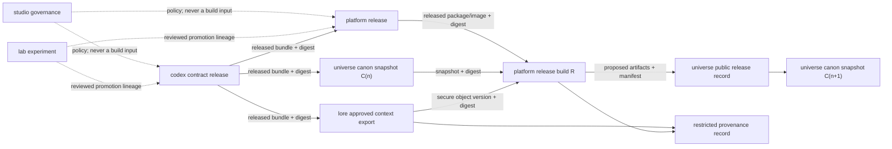

# Cross-repository dependency strategy

This directory implements
[ADR 0006](../adr/0006-cross-repository-dependencies-and-versioning.md). It is
the organization-level policy for dependency direction, stable references,
compatibility, and release provenance.

## Dependency and promotion graph



Dotted arrows are promotion or governance, not build dependencies. Solid arrows
carry immutable artifacts. The release graph for one build must be a directed
acyclic graph.

## Allowed directions

| Producer | Consumer | Allowed boundary | Prohibited shortcut |
| --- | --- | --- | --- |
| `lab` | `codex` | Reviewed promotion with Lab commit recorded as lineage | Importing a Lab path or treating an experiment tag as a contract |
| `lab` | `platform` | Reimplemented or hardened work accepted by Platform | Production import from `lab/main` |
| `codex` | `platform` | Released contract bundle pinned by version, commit, URI, size, and digest | Copying schemas or following a branch |
| `codex` | `universe` | Released IDs, schemas, and manifest contracts | Editing local forks as authoritative contracts |
| `codex` | `lore` | Released private-context contract; no story content in Codex | Private contract variants that silently diverge |
| `universe` | `platform` | Released public canon snapshot or approved public asset bundle | Build-time clone, submodule, or vendored canon |
| `lore` | `platform` | Minimal approved export through a secure versioned artifact store | Repository checkout, broad export, or source persistence |
| `platform` | `universe` | Proposed public release artifacts and provenance manifest | Platform directly declaring canon or editing canon outside review |
| `studio` | all | Human and automated policy conformance | Runtime, build, package, or schema dependency on Studio |

No other direction is allowed without amending the architecture ADR. A workflow
that sends an output back to a repository is not permission to depend on a
future record containing that same output.

## Stable reference tuple

Every production dependency records:

```text
repository + logical version + immutable tag + source commit
+ artifact URI + media type + byte size + sha256 digest
```

The consumer verifies size and digest before parsing or executing the artifact.
Lockfiles and release manifests store the exact tuple. Version ranges may be
used by update automation to discover candidates, but builds resolve and commit
one exact artifact reference.

Use these distribution mechanisms in order:

1. the ecosystem package registry for a real package, pinned by lockfile and
   registry integrity digest;
2. an OCI registry reference by manifest digest for containers or suitable OCI
   artifacts; and
3. an immutable GitHub Release asset for portable bundles such as Codex
   contracts, canon snapshots, or provenance records.

For public release-producing repositories, enable GitHub release immutability,
prepare the release as a draft, attach all assets, verify them, and publish once.
Generate a GitHub artifact attestation when supported by the build workflow.

## Explicitly deprecated references

- branches, including `main`, in a build or production manifest;
- floating version ranges in a committed production lock;
- mutable container tags such as `latest` without a digest;
- Git submodules and Git subtree copies for Studio-owned cross-repository work;
- download URLs without a content digest and expected size;
- local copied schemas or generated bundles with no upstream provenance; and
- public references to private Lore paths, commits, object versions, or hashes.

## Policy documents

- [`COMPATIBILITY.md`](COMPATIBILITY.md) defines version and breaking-change
  rules.
- [`PROVENANCE.md`](PROVENANCE.md) defines public and restricted release records.
- [`examples/`](examples/) contains non-normative examples. Codex will own the
  corresponding machine-readable schemas before production use.
