# Prompt SDK v1 architecture

This document defines the organization-level architecture, responsibility
boundaries, and v1 scope for the Definitely Secure Studio Prompt SDK. The
governing decision is [ADR 0016](../adr/0016-prompt-sdk-architecture.md).
Normative prompt formats and runtime APIs belong to their owning repositories;
this document does not replace those contracts.

## Goals

Prompt SDK v1 makes prompts durable, portable software artifacts. A prompt can
be identified, versioned, validated, deterministically rendered from declared
inputs, executed through a replaceable provider adapter, and traced without
making a model vendor, hosted prompt service, or private creative repository
authoritative.

The architecture must:

- keep stable semantics in `codex`, experiments in `lab`, and production code
  in `platform`;
- separate prompt definition, rendering, validation, execution, and result
  boundaries;
- consume explicit Context Builder packages without retrieving or assembling
  Canon or Lore;
- isolate credentials, transport, retries, provider identifiers, and optional
  provider features behind Studio-owned adapter contracts;
- preserve safe execution provenance for later manifests and releases; and
- leave extension points without making image, multimodal, validation-agent,
  or autonomous-agent orchestration part of the v1 core.

## Authority and responsibility

| Owner | Authoritative responsibility | Must not own |
| --- | --- | --- |
| `studio` | Cross-repository architecture, governance, risk and exception decisions, and this responsibility boundary | Prompt schemas, runtime code, prompt content, or provider configuration |
| `codex` | Prompt Specification, stable IDs and versions, machine-readable schemas, capability vocabulary, template and execution contracts, extension envelope, error taxonomy, provenance contract, fixtures, compatibility, and reference validation behavior | Provider SDKs, credentials, production registries, experimental prompt content, Canon, Lore, or context selection |
| `lab` | Experimental prompt definitions and patterns, provider/capability trials, evaluators, synthetic fixtures, measurements, limitations, and promotion evidence | Stable contracts, production implementation, private Lore, unpublished Canon, or a production dependency |
| `platform` | Production SDK and CLI, registry implementation, contract validation, deterministic renderer, provider-neutral executor, provider adapters, structured-output handling, provenance emission, observability hooks, tests, packages, and releases | Redefining Codex contracts, selecting Canon/Lore, owning context assembly, declaring Canon, or approving publication |
| Context Builder (Epic #5) | Selecting, minimizing, classifying, assembling, approving, versioning, and delivering context packages under a Codex contract | Prompt rendering, provider execution, or prompt-registry authority |
| `universe` | Reader-safe Canon and public release records that may reference approved prompt/build provenance | Prompt contracts, SDK implementation, or private execution evidence |
| `lore` | Private Lore authority, approved minimal private context exports, and restricted provenance mappings | Public prompt definitions, Platform source, or publication approval |
| Build Orchestrator (Epic #7) | Ordering multiple SDK calls, budgets across steps, retry/rollback policy across a build, and release-candidate coordination | Prompt semantics, adapter implementation, Canon decisions, or final publication approval |

Promotion from `lab` is a reviewed lineage event. Codex restates a stable
experiment as an implementation-neutral contract; Platform independently
accepts or reimplements production behavior. Neither repository imports
`lab/main` as a durable dependency.

## Core domain objects

The names below define ownership boundaries. Issue
[#62](https://github.com/DefinitelySecureStudio/studio/issues/62) will define
their normative fields and machine-readable schemas in Codex.

### Prompt definition

A **prompt definition** is an immutable, portable document conforming to one
exact Prompt Specification version. It declares:

- stable prompt identity, explicit version, lifecycle, owner, purpose, and
  intended use;
- typed inputs, constraints, required/optional status, and safe examples;
- one or more provider-neutral template sections or ordered messages;
- required capabilities and portable generation parameters;
- expected output kind and an optional released structured-output contract;
- context slots and the classifications they may accept;
- policy-relevant metadata, compatibility, deprecation, and explicit
  namespaced extensions; and
- the exact constitutional and Codex contract references required by policy.

It contains no credentials, implicit environment/file reads, private context,
rendered production content, mutable provider object as authority, or hidden
runtime default that changes its meaning.

### Prompt template

A **prompt template** is the renderable provider-neutral message/section
structure inside a prompt definition. It references only declared variables and
context slots. Rendering has a documented escaping and serialization model and
cannot invoke a model, tool, network, clock, random source, environment
variable, filesystem path, Canon/Lore query, or arbitrary code.

### Rendered prompt

A **rendered prompt** is the immutable, ordered, provider-neutral result of
applying one exact prompt definition to explicit validated inputs and explicit
context-slot values. It records the renderer version and a safe integrity
identity. It is an execution input, not a new prompt definition, Canon record,
approval, or release.

Rendering is deterministic for the same definition bytes, renderer contract,
declared inputs, and supplied context bytes. Sensitive rendered content remains
in its approved handling boundary; public provenance uses a safe reference or
non-derivable attestation rather than disclosing it.

### Execution request

An **execution request** asks one adapter to execute one rendered prompt. Its
provider-neutral portion contains:

- execution and correlation identities;
- rendered-prompt identity or authorized content;
- required capabilities and portable generation parameters;
- expected output contract and validation mode;
- context-package references and preserved classification metadata;
- caller delegation, budget/deadline, idempotency, cancellation, and safe
  observability policy; and
- explicitly selected namespaced provider extensions, if any.

The request does not contain provider credentials. The Platform adapter obtains
credentials from approved runtime configuration and translates the request
without changing Studio-owned semantics.

### Execution result

An **execution result** is the normalized outcome returned by the execution
boundary. It contains status, selected output or safe output reference,
provider/model/adapter identity, timing and normalized usage, finish reason,
validation outcomes, warnings, and a normalized error when unsuccessful. Raw
provider responses may be retained only as sensitivity-appropriate restricted
evidence.

A successful result proves only that the execution contract completed. It is
not a statement of truth, Canon, quality, rights clearance, security approval,
or publication approval.

### Execution provenance record

An **execution provenance record** links the exact definition, specification,
renderer, explicit inputs, context attestations, execution request, adapter,
provider/model, relevant parameters, result, validations, timestamps, and
responsible human/workflow delegation. It distinguishes recorded facts from
interpretation and records withheld/unavailable evidence explicitly.

The execution result is runtime data; the provenance record is durable evidence.
They may share an execution ID but remain separate contracts so callers can
retain evidence without retaining sensitive prompt or output bodies.

## Component model

```mermaid
flowchart LR
    author["Author or calling workflow"]
    registry["Prompt registry<br/>Platform"]
    definition["Prompt definition<br/>Codex contract"]
    validator["Validator and linter<br/>Platform"]
    context["Prepared context package<br/>Context Builder"]
    renderer["Deterministic renderer<br/>Platform"]
    request["Execution request<br/>Codex contract"]
    executor["Provider-neutral executor<br/>Platform"]
    adapter["Provider adapter<br/>Platform"]
    provider["Model provider"]
    result["Execution result<br/>Codex contract"]
    provenance["Safe provenance record<br/>Platform emission"]
    caller["Caller / Build Orchestrator"]

    author -->|"exact ID + version"| registry
    registry -->|"verified immutable definition"| definition
    definition --> validator
    context -->|"explicit package + slot mapping"| validator
    validator --> renderer
    renderer --> request
    request --> executor
    executor -->|"capability match"| adapter
    adapter -->|"provider transport"| provider
    provider --> adapter
    adapter --> result
    result --> caller
    definition -. "identity and version" .-> provenance
    context -. "safe reference or attestation" .-> provenance
    request -. "parameters and delegation" .-> provenance
    result -. "status, usage, output identity" .-> provenance
```

## Processing sequence and failure boundaries

1. The caller asks the registry for an exact prompt ID and version. Floating
   constraints may discover candidates during authoring but cannot remain in a
   production execution or release record.
2. The registry returns verified definition bytes and their complete stable
   reference. Missing, ambiguous, incompatible, or digest-mismatched definitions
   fail before rendering.
3. The validator checks the definition, declared input values, context-slot
   contract, output contract, capability requirements, extension declarations,
   and caller policy. It does not contact a provider.
4. The renderer produces one deterministic provider-neutral rendered prompt
   using only the validated explicit values.
5. The executor selects an explicitly configured adapter whose declared
   capabilities satisfy the request. Selection never silently weakens a
   required capability.
6. The adapter translates portable fields, validates any provider extension,
   obtains credentials outside the request, invokes the provider, and normalizes
   the response or error.
7. Structured output is parsed and validated when declared. Invalid output is
   an explicit result state and is not silently repaired unless a separately
   authorized retry or repair workflow requests another execution.
8. The SDK returns the result and emits a sensitivity-appropriate provenance
   record. The caller decides whether to retry, continue a larger workflow, or
   submit an artifact to later human gates.

Validation, rendering, one model call, output parsing, and evidence emission
are distinct stages. Each stage returns typed diagnostics. Partial execution,
timeouts, cancellation, duplicate requests, and evidence-write failure remain
observable; the SDK never reports an unrecorded or ambiguous execution as a
clean success.

## Cross-cutting safeguards

- Definitions, inputs, context, tools, providers, outputs, logs, and evidence
  retain their security, privacy, confidentiality, rights, and content
  classifications across every transformation.
- Model output and provider metadata are untrusted data. They cannot supply
  authorization, policy, tool permission, Canon state, provenance facts, or
  approval merely by asserting them.
- Credentials enter only inside an approved adapter runtime and are excluded
  from definitions, requests, fixtures, diagnostics, output contracts, and
  provenance records.
- Third-party prompt text, examples, context, media, and outputs require exact
  source/provenance, permission, compatible intended use, notices, and the
  applicable human rights review. Uncertain rights or material similarity stop
  downstream use.
- Validation covers syntax, declarations, capabilities, classifications,
  output contracts, safe logging, and bounded accessibility requirements, but
  does not replace human review of meaning, creative intent, audience impact,
  rights, or publication.
- Public fixtures are synthetic, licensed, or already public. Private context,
  provider responses, and sensitive evidence stay inside approved retention,
  deletion, access, backup, and recovery boundaries.
- Retry behavior is caller-authorized and bounded. The SDK does not silently
  retry a non-idempotent action, increase cost, relax validation, change models,
  discard extensions, or repair output through an undeclared model call.
- A provenance-write failure, classification conflict, expired context,
  authorization failure, unknown required extension, or ambiguous output
  identity fails closed for consequential workflows.

## Context Builder boundary

The Context Builder owns retrieval, source authority, selection, minimization,
ordering, classification, approvals, expiry, and context-package assembly. The
Prompt SDK accepts only an explicit package or stable reference supplied by its
caller.

The integration contract requires:

- a released Codex context-package contract version and complete immutable
  artifact reference;
- package identity, creation and expiry/review information, intended consumer,
  section identities, classifications, and integrity;
- named prompt context slots with deterministic section placement;
- preserved source/version metadata or an approved non-derivable private
  attestation for provenance;
- clear failure for missing, expired, unauthorized, incompatible, oversized,
  misclassified, or digest-mismatched context; and
- policy enforcement outside model output before rendering and execution.

The Prompt SDK may report size/token estimates and capability constraints. It
must not query Universe or Lore, rank/retrieve sources, broaden a package,
summarize private material to fit, discard classification, renew approval,
declassify content, or write context back to an authoritative repository.

Public context may use a complete stable reference. Private context uses the
approved secure object inside Platform and a restricted provenance mapping;
public records receive only the opaque attestation allowed by Studio policy.

## Provider-neutral execution and extensions

Codex owns the adapter contract, portable capability vocabulary, normalized
parameters, result fields, and error categories. Platform owns adapter code,
provider SDK versions, authentication, transport, rate limits, retries,
cancellation, provider identifiers, and raw diagnostic handling.

The v1 portable baseline is synchronous text/message execution with optional
structured-output validation. An adapter declares capabilities before use.
Unsupported required capability or unrepresentable portable parameter fails
clearly before or at the adapter boundary.

Provider-specific behavior is allowed only through a Codex-defined extension
envelope with a stable namespace. Each use declares whether the extension is
required or optional, expected behavior, data/rights implications, portable
fallback or explicit no-fallback behavior, provenance fields, and failure mode.
Adapters must reject unknown required extensions. Extensions cannot silently
change a portable field, hide provider/model identity, or become required by an
unrelated prompt.

SDK core packages import only Studio contracts and adapter interfaces. Provider
SDK imports remain inside adapter packages. A mock adapter implements the same
contract and is the default for conformance tests.

## Registry and version boundaries

Codex releases Prompt Specification and contract bundles using the Studio
stable reference tuple. Platform releases the SDK implementation separately.
Prompt definitions have their own stable IDs and versions and may be distributed
through a registry implementing the Codex registry contract.

The registry is a resolver and distribution mechanism, not an authority that
can rewrite definition meaning. Production resolution yields immutable bytes,
source identity, semantic version, exact commit, artifact URI, media type, byte
size, and verified digest. Cached entries retain this identity. A hosted prompt
service may implement the interface but cannot be the only portable copy or the
source of hidden runtime edits.

Compatibility is assessed independently across:

- Prompt Specification version;
- individual prompt-definition version;
- referenced output/context contract versions;
- Platform SDK version; and
- adapter/provider capability version.

## Provenance and release boundary

Every execution records, as policy permits:

- execution/correlation ID and status;
- prompt ID/version plus exact definition and Prompt Specification references;
- renderer and Platform SDK versions;
- explicit non-secret input identities or safe digests;
- context-package version/reference or opaque private attestation;
- adapter, provider, model, capability, portable parameters, and selected
  provider extensions;
- start/end time, duration, normalized usage, retries, cancellation, and errors;
- rendered-prompt and output identities or restricted evidence references;
- lint, input, capability, and structured-output validation results; and
- calling workflow/build identity, delegation, and human approvals when they
  already exist.

Logs and metrics are not the sole provenance store and do not contain secrets
or unnecessary prompt, context, or output bodies by default. Provider opacity
is recorded honestly; a seed does not imply exact reproducibility.

Comic Manifest and Build Orchestrator contracts may reference execution
records, but they own build-level ordering and release provenance. Universe
owns the public reader-safe release record. The Prompt SDK cannot turn a model
result into Canon or authorize a release.

## Extension model

The object model uses typed content parts, capability declarations, output
contracts, and namespaced extensions so later work can add behavior without
changing v1 ownership:

| Future area | Reserved v1 seam | Deferred responsibility |
| --- | --- | --- |
| Image generation | Media content parts, image capability descriptors, binary artifact references | Image parameters, renditions, safety/rights gates, and adapter conformance |
| Multimodal input/output | Ordered typed parts and media references | Modality-specific schemas, size/format rules, transforms, and accessibility evidence |
| Validation/evaluator prompts | Purpose metadata and ordinary execution/result contracts | Evaluation authority, rubrics, independence, aggregation, and promotion gates |
| Agent prompts | Tool/capability declarations and execution correlation | Tool authorization, multi-step state, memory, planning, delegation, budgets, recovery, and human takeover |
| Streaming/asynchronous execution | Execution ID, status, cancellation, and event-compatible result model | Event ordering, resumability, partial output policy, durable queues, and subscription APIs |

An extension becomes core only through a compatible Codex contract change or a
new major version. Platform-only behavior cannot redefine the stable prompt
format.

## Prompt SDK v1 scope

V1 includes:

- portable, machine-readable prompt definitions with stable IDs and explicit
  versions;
- declared typed variables and provider-neutral ordered text/message templates;
- deterministic, side-effect-free rendering from explicit inputs;
- schema validation and bounded lint diagnostics before execution;
- exact-version registry resolution and local/offline definition loading;
- synchronous provider-neutral text execution through replaceable adapters;
- portable capability negotiation and generation parameters;
- optional structured-output contract references, parsing, and validation;
- explicit prepared context-package consumption through named slots;
- safe execution results, normalized errors, provenance, and observability
  hooks;
- CLI operations for inspect, validate, render, and mock/explicit execution;
- a mock adapter, synthetic fixtures, and provider-free conformance tests; and
- explicit extension envelopes and failure behavior for unsupported features.

## V1 non-goals

V1 does not provide:

- Canon/Lore search, semantic retrieval, ranking, context selection, assembly,
  summarization, approval, or declassification;
- a new prompt-writing language with arbitrary code, network, filesystem,
  environment, clock, or randomness access;
- autonomous agents, tool loops, memory, multi-step workflow orchestration,
  queues, streaming, or resumable execution;
- first-class image, audio, video, or general multimodal generation;
- automatic prompt optimization, provider routing based solely on opaque model
  judgment, or self-modifying production prompts;
- a hosted prompt-management SaaS as an authoritative dependency;
- storage of provider credentials, private production context, or raw sensitive
  observability bodies in prompt definitions or source control;
- ownership of comic/build manifests, release orchestration, Canon decisions,
  rights clearance, security/privacy approval, or publication; or
- a guarantee that different providers produce identical creative output.

## Conformance and review triggers

This architecture is assessed against the universal, ADR/RFC/stable-
specification, repository/system, and agent/workflow profiles of the
[Constitution compliance checklist](../CONSTITUTION_COMPLIANCE.md), using:

- version `1.0.0`;
- tag `constitution/v1.0.0`; and
- commit `a9cc8a503aa30e17820edc62ac95f7cbe10e0564`.

The exact contracts created under issues #62 through #69 need their own Codex
and Platform evidence. Re-review this architecture before changing repository
authority, context ownership, portable baseline, extension semantics, provider
boundary, protected-data handling, execution approval, release authority, or
the v1 scope/non-goals.
